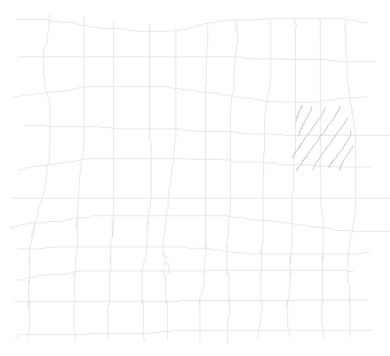
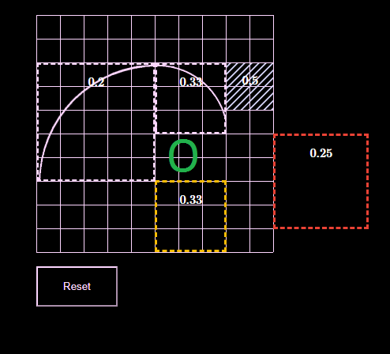
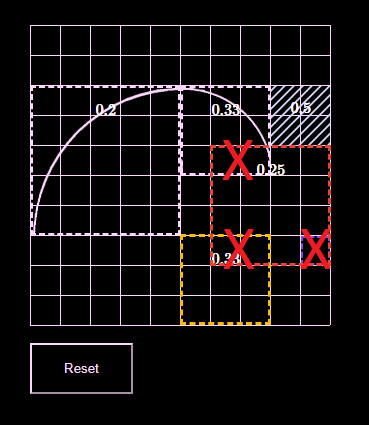
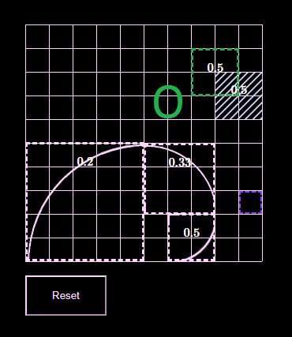
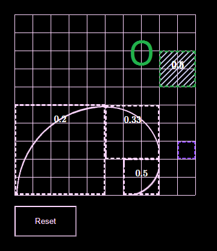
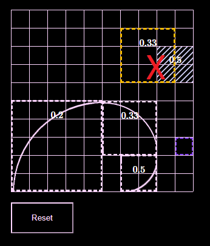

# Introducing MathJ | </img>

Little simulation for `MathJ`, match a puzzle until pattern [Fibonnaci](https://en.wikipedia.org/wiki/Fibonacci_number) shaped absolute.

</img>

Puzzle failed if theirs any a multiplication block to each other pieces (just in simulation, it will be can't quite possible on physical version).

</img>

#
# MathJ

Blockaded area only work for a number was already presence.

<b>Do :</b>

</img>

</img>

<b>Don't :</b>

</img>
